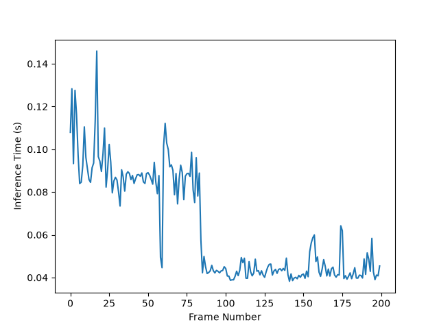
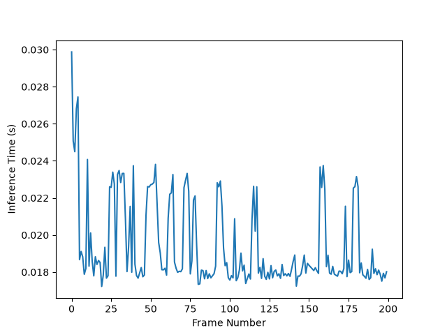

# ov-cv

Benchmarking performance of OpenVINO for YOLO26 models

Hardware:
- CPU: 12th Gen Intel Core i7-12800H
- GPU: Intel UHD Graphics (iGPU)

Models:
- yolo26n
- yolo26n-pose

Results:
- Around 3x inference speed on GPU vs CPU for both yolo26n and yolo26n-pose (see trials/)

CPU Inference Times with yolo26n (`main.py`)

GPU Inference Times with yolo26n (`main.py`)

